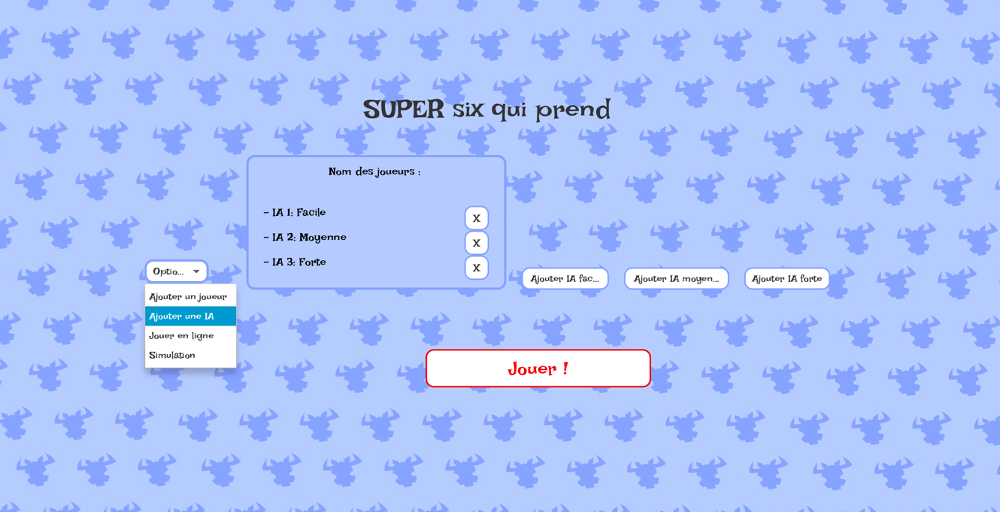

# Jeu six qui prend

### Bienvenus sur notre super _Six Qui Prend_, have fun :)

La première page qui apparait lorsque le jeu est lancé est la page d'accueil, centre et point de départ de toute partie 
du Six qui prend. 

## Page d'accueil 
La page d'accueil contient toutes les différentes façons de jouer au *Six qui prend*, soit en local, soit en ligne, avec 
ou sans IA. Pour accéder aux différentes manières de composer une partie, le menu déroulant **"Options"** permet de 
sélectionner parmi l'ajout d'un joueur local, l'ajout d'IA et la connexion à une partie en ligne. 

### Mode Local 

En local, il est possible d'ajouter jusqu'à **dix joueurs** qui joueront sur le même appareil. 
Le joueur rentre son nom et clique sur **"Ajouter"** puis c'est à la personne suivante de rentrer son nom. 
Entre les joueurs sur le même appareil, pour éviter de voir les cartes des autres joueurs, il y a un écran de transition,
pour continuer le tour, le joueur doit appuyer sur **"Continuer"**. 

### Jouer avec une IA

Il est possible d'ajouter une ou plusieurs IA lors d'une partie locale, pour compléter la liste des participants ou 
ajouter des adversaires. Comme le nombre de joueurs ne peut dépasser dix, les IA peuvent seulement compléter la liste des 
participants pour arriver à dix.
Il y a trois différentes difficultés pour les IA: facile, moyen et fort.

**IA Facile** : l'IA facile va jouer la carte la plus proche de la dernière carte la plus petite parmis toutes les rangées
sans tenir compte d'aucun autre facteur. 

**IA Moyen** : l'IA moyen va jouer la carte la plus proche de la dernière carte la plus petite parmis toutes les rangées 
éligible à jouer, c'est-à-dire les rangées qui n'ont pas déjà 5 cartes de joués, et qui peuvent être choisi sans pénalités.
S'il n'y a pas de rangées possibles, l'IA moyen va jouer sa plus petite carte.

**IA Fort** : l'IA Fort va jouer la carte auquel il obtient sa plus petite difference parmis toutes les rangées éligible.
Il effectue les differences entre ses cartes et la derniere carte de chaque rangée éligible, puis va prendre la carte 
auquel il obtient la plus petite difference possible

### Mode en ligne

Le mode en ligne permet de jouer sur un serveur avec différentes autres personnes, chacune sur un appareil différent. 
Pour entrer son nom dans le mode en ligne, il faut rentrer son nom et cliquer sur **"Jouer en ligne"**, cela amène le 
joueur dans un lobby ou les autres joueurs attendent pour commencer la partie. Si le joueur ne rentre pas de nom, il aura 
automatiquement un nom de la forme *"joueur X"* avec son numéro dans la liste des joueurs en attente. 

L'**hôte** est le leader de la partie en ligne, il est le premier à être entré dans le lobby et il a le pouvoir de lancer 
la partie. Il est le seul à avoir accès au bouton **"Lancer la partie"**, les autres joueurs ont simplement une instruction
demandant d'attendre que l'hôte lance la partie. 

## Déroulement d'une partie 

### Table de jeu

La table de jeu est séparée en plusieurs parties : le numéro de round, le nom du joueur en train de jouer, les scores du round,
les quatre rangées de cartes déjà posées et la main du joueur en train de jouer. 

###  Le jeu

Les règles sont les mêmes que lors d'une partie de _Six Qui Prend_. Le joueur sélectionne la carte qu'il souhaite jouer 
en cliquant dessus, elle sera alors affichée dans le cadre **"carte jouée"** à côté de la main du joueur et lorsque le 
tour est fini, la carte se place automatiquement sur la rangée avec le numéro le plus proche. Lorsque le joueur joue une
carte qui ne peut aller sur aucune des lignes, d'après les règles le joueur doit ramasser une des rangées et poser sa carte 
en tant que première de cette rangée maintenant vierge. La rangée qui est ramassée par le joueur est automatiquement 
celle qui lui rapportera le minimum de points, il n'a pas la possibilité de choisir.

### Fin de la partie

La partie se termine lorsque toutes les cartes ont été posées par tous les joueurs, le gagnant est celui avec le moins de 
points. L'écran de fin indique le gagnant et rappelle les scores de chacun des participants classés en fonction de leur score.
Il est possible de quitter le jeu ou de rejouer une partie ce qui renvoie à la page d'accueil du jeu. 

## Tests et simulation 

### Tests

Nous avons souhaité avoir le plus grand score de _Code Coverage_ possible et ce grâce à un nombre important de tests 
unitaires. Ils fonctionnent tous correctement. 

### Simulation

En voulant tester la fiabilité de nos IA, nous avons souhaité mettre en place un système de simulation de parties. 
Le menu simulation de partie est accessible depuis le menu **"Options"** sur la page d'accueil. 
Il permet de pouvoir choisir un nombre d'IA et leur difficulté, ainsi que le nombre de répétitions. À la fin de la 
simulation, le nombre de victoires par difficulté est inscrit sur l'écran. Cela nous a permis de vérifier la fiabilité 
de nos IA et leur niveau. 
