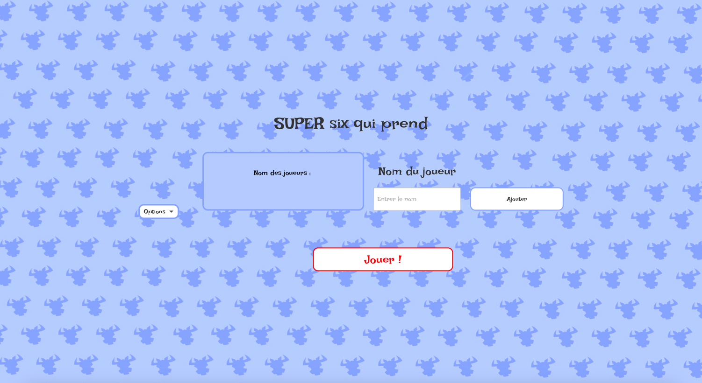

# Jeu six qui prend
### Bienvenus sur notre super _Six Qui Prend_, have fun :)
La première page qui apparait lorsque le jeu est lancé est la page d'accueil, centre et point de départ de toute partie du Six qui prend. 
## Page d'accueil 
La page d'accueil continent tous les différentes facons de jouer au *Six qui prend*, soit en local soit en ligne, avec 
ou sans IA. Pour accéder au différentes façons de composer une partie, le menu déroulant **"Options"** permet de 
séléctionner parmi l'ajout d'un joueur local, l'ajout d'IA et la connexion a une partie en ligne. 
### Mode Local 

En local, il est possible d'ajouter jusqu'à dix joueurs qui joueront sur le même appareil. 
Le joueur rentre son nom et clique sur **"Ajouter"** puis c'est à la personne suivante de rentrer son nom. 
Entre les joueurs sur le même appareil, pour éviter de voir les cartes des autres joueurs, il y a un écran de transition,
pour continuer le tour, le joueur doit appuyer sur **"Continuer"**. 
### Jouer avec une IA

Il est possible d'ajouter une ou plusieurs IA lors d'une partie locale, pour compléter la liste des participants ou 
ajouter des adversaires. Comme le nombre de joueurs ne peut dépasser dix, les IA peuvent seulement complétér la liste des 
participants pour arriver a dix.
Il y a trois différentes difficultés pour les IA: facile, moyen et fort.

**IA Facile** : 

**IA Moyen** : 

**IA Fort** : 

